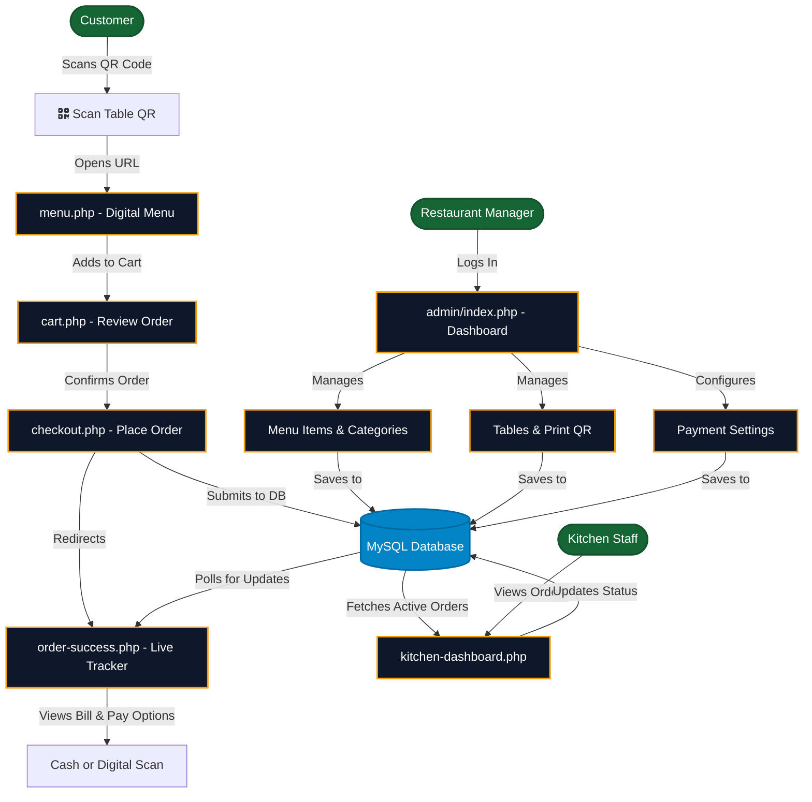

# QR Cafe - Restaurant Management System

QR Cafe is a modern, mobile-first Restaurant Management System (RMS) designed to streamline dining experiences. Customers can simply scan a QR code placed on their table to browse a digital menu, place orders directly to the kitchen, and track their order status in real-time.

## 🚀 Key Features

*   **Digital Menu & Contactless Ordering:** Customers scan a table-specific QR code to access a beautifully designed digital menu and place orders from their phones.
*   **Live Kitchen Display System (KDS):** A real-time dashboard for kitchen staff to view incoming orders and update statuses (`New` → `In Prep` → `Ready` → `Served`).
*   **Admin Dashboard:** Comprehensive backend for managers to:
    *   Manage menu items, categories, and prices.
    *   Manage seating and tables.
    *   Generate and print QR codes for each table.
    *   View all live and past orders.
    *   Configure payment settings (e.g., eSewa, Khalti details).
*   **Auto Database Setup:** Seamless first-time installation. The application automatically creates the database and required tables upon the first connection.
*   **Progressive Web App (PWA) Ready:** Responsive mobile-first design built with Tailwind CSS for a native app-like feel.

## 🛠️ Technology Stack

*   **Backend:** PHP 8+
*   **Database:** MySQL / MariaDB (MySQLi extension)
*   **Frontend:** HTML5, Tailwind CSS (via CDN), Vanilla JavaScript
*   **Server:** Apache (XAMPP/WAMP recommended for local development)

## 📦 Installation & Setup

1.  **Clone or Copy the Project:**
    Place the `RMS_System` folder inside your local web server's document root (e.g., `htdocs` for XAMPP or `www` for WAMP).

2.  **Configure Database Credentials:**
    Open `config.php` and verify your MySQL credentials:
    ```php
    define('DB_HOST', 'localhost');
    define('DB_USER', 'root');
    define('DB_PASS', '');
    // DB_NAME is set to 'qr_restaurant' by default
    ```

3.  **Automatic Database Initialization:**
    Simply navigate to `http://localhost/RMS_System/` in your browser. The system's auto-migration feature (`ensureDatabaseSchema`) will automatically:
    *   Create the `qr_restaurant` database.
    *   Create all necessary tables (`admin_users`, `orders`, `order_items`, `menu_items`, `categories`, `tables`, `payment_settings`, etc.).
    *   Insert a default admin user.

4.  **Admin Login:**
    *   **URL:** `http://localhost/RMS_System/admin/`
    *   **Default Username:** `admin`
    *   **Default Password:** `admin123`
    *(Please change these credentials after your first login!)*

## 📂 Project Structure

*   `/admin/` - Backend dashboard for restaurant managers.
*   `/api/` - JSON API endpoints used for AJAX requests (e.g., updating kitchen status).
*   `/css/` & `/js/` - Custom stylesheets and JavaScript files.
*   `/images/` - Uploaded menu item images and payment QR codes.
*   `config.php` - Database connection and schema auto-generation script.
*   `database.sql` - Complete SQL dump of the schema for manual setup or reference.
*   `menu.php` - The digital menu interface for customers.
*   `cart.php` & `checkout.php` - Customer ordering pipeline.
*   `kitchen-dashboard.php` - Real-time Kitchen Display System.
*   `order-success.php` - Live tracking page for customers after placing an order.

## 🎨 UI/UX Highlights

*   **Dark Mode Aesthetic:** Built with a modern `zinc-950` dark theme with `amber-500` accents for high contrast and readability.
*   **Interactive Feedback:** Includes micro-interactions, modal sheets, toast notifications, and skeleton loaders to enhance the user experience.
*   **Responsive:** Works perfectly on smartphones, tablets, and desktop browsers.

## 🎯 Core & MVP Features

### Minimum Viable Product (MVP) Features
- **QR Code Menu Access:** Customers can scan a physical QR code on their table to open the digital menu.
- **Digital Menu Browsing:** Display menu items organized by categories with names, descriptions, prices, and images.
- **Cart & Checkout System:** Customers can add items to their cart, review their order, and submit it directly to the kitchen.
- **Live Order Tracking:** Customers receive an order ID and can track the real-time status of their food.
- **Kitchen Dashboard (KDS):** A unified screen for chefs to see incoming orders and mark them as `Preparing`, `Ready`, or `Completed`.
- **Basic Admin Panel:** A secure area to manage menu items, categories, and seating tables.

### Extended Core Features
- **Dynamic QR Generation:** The admin panel can automatically generate printable QR codes for each specific table.
- **Digital Payment Integration Info:** Supports displaying eSewa/Khalti merchant QR codes to customers for digital settlements.
- **Auto-Installation Script:** A zero-touch database setup process making deployment incredibly simple.
- **Dark Mode PWA:** Progressive Web App configurations for an app-like feel on mobile devices.

## 🔄 System Workflow

1. **Table Setup:** The Admin creates tables in the dashboard and prints the generated QR codes.
2. **Customer Arrival:** The customer sits at a table and scans the QR code using their smartphone camera.
3. **Browsing & Ordering:** The QR code opens `menu.php?table={table_number}`. The customer browses, adds items to their cart, and checks out.
4. **Kitchen Notification:** The order instantly appears on the Kitchen Display System (`kitchen-dashboard.php`).
5. **Fulfillment:** The kitchen staff updates the order status as they cook. The customer sees these live updates on their phone via `order-success.php`.
6. **Settlement:** The order is marked as `Served`. The customer pays via cash or scans the digital payment QR code provided on their tracking screen.

## 📊 Application Flowchart


